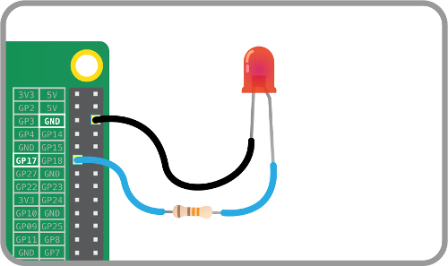
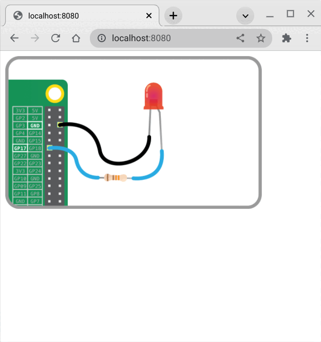

# Merle

[Merle](https://merliot.org) is a framework for building secure web-apps for your IoT project.

Put your **Thing** on the **Internet** with Merle.

Merle uses the Go programming language.

## Set Up Your Environment

### Installing Go

Go is an open-source programming language that makes it easy to develop simple, reliable, and efficient software.

Go may already be installed on your distribution.  Try running ```go version``` to verify.

```sh
$ go version
go version go1.17.3 linux/amd64
```

If Go is not installed, follow the [official installation instructions](https://go.dev/doc/install) to get started.

## Installing Merle

With Go installed, the ```go get``` tool will help you install Merle and its required dependencies:

```sh
$ go get github.com/scottfeldman/merle
```

# Tutorial

This tutorial is broken into multiple steps, each step building on the
previous.  The goal is to build a working, secure web-app available anywhere on
the Internet for your Thing.  In this tutorial, your Thing is a Raspberry Pi,
an LED, a resistor, and some wires.  We're going to make the LED blink and show
and control the LED status with the web-app.


*Thing wiring*

If you don't have the hardware needed for this tutorial, you can still run
through the tutorial.  There is no real LED to blink, so that's not very
exciting, but everything else should work.  All that's really needed is a
system with the Go environment installed.

## Step 1: Minimal Thing

This is the start of our Thing.  We'll call it blink.go.  It's basically the
smallest Thing you can make in Merle, but it will compile and run.  It doesn't
do anything, yet.

```go
// file: examples/tutorial/blinkv1/blink.go

package main

import (
	"github.com/scottfeldman/merle"
)

type blink struct {
}

func (b *blink) Subscribers() merle.Subscribers {
	return merle.Subscribers{}
}

func (b *blink) Assets() *merle.ThingAssets {
	return &merle.ThingAssets{}
}

func main() {
	var cfg merle.ThingConfig

	merle.NewThing(&blink{}, &cfg).Run()
}
```

A Thing in Merle is a Go program which implements and runs the Thinger
interface.  The Thinger interface has two methods: Subscribers and Assets.

```go
type Thinger interface {
	Subscribers() Subscribers
	Assets() *ThingAssets
}
```

Subscribers is a list of message handlers for your Thing.  We'll see later in
this tutorial that **everything** is a message in Merle, and Subscribers is the
message dispatcher.

Assets are the Thing's web assets, things like HTML and Javascript files.
These assets make up the front-end of your Thing (the side you see with a web
browser).

In our minimalist Thing, we don't (yet) subscribe to any messages and we don't
have any web assets.

Let's run our Thing and see what happens.  First, build Merle at the top level
to build the tutorial.

```sh
$ go install ./...
```

Then run our Thing:

```sh
$ ../go/bin/blinkv1
2022/01/24 17:57:26 Defaulting ID to 00:16:3e:30:e5:f5
2022/01/24 17:57:26 Skipping private HTTP server; port is zero
2022/01/24 17:57:26 Skipping public HTTP server; port is zero
2022/01/24 17:57:26 Skipping tunnel; missing host
[00:16:3e:30:e5:f5] Not handled: {"Msg":"_CmdRun"}
```

Ignore the "Skipping..." log messages for now.  Those are features we'll enable
in future steps.  The first thing to notice is the Thing was assigned an ID of
00:16:3e:30:e5:f5.  If that looks like a MAC address, you're right.  Every
Thing has an ID and since one wasn't given in the program, a default is
assigned, made up from a MAC address of one of the network interfaces on your
system.

The second thing to notice is the program quit.  It should not quit.  In this
case, the message CmdRun was not handled.  In the next step on this tutorial,
we'll handle the CmdRun message to blink the LED.

## Step 2: Blink the LED

Let's wire up the LED to the Raspberry Pi.


### Parts List

- Rapsberry Pi (any model except Pico)
- An LED
- A 120ohm resistor
- some wire.

Wire the LED and resistor to GPIO pin 17 and ground as shown.

Let's add a handler for CmdRun.  Every Thing should handle CmdRun.

```go
func (b *blink) run(p *merle.Packet) {
	select {}
}

func (b *blink) Subscribers() merle.Subscribers {
	return merle.Subscribers{
		merle.CmdRun: b.run,
	}
}
```

The CmdRun handler should not exit unless some error occurs.  Otherwise, CmdRun
handler is the main loop for the Thing and is designed to run forever.  CmdRun
handler must not block.  select{} will not block or exit.  But we need to do
more than sleep so let's initialize the hardware and blink the LED.

We're using the excellent [GoBot](https://gobot.io) package to blink the LED
from the Raspberry Pi.  The CmdRun handler calls GoBot in Metal mode.

```go
import (
	"github.com/scottfeldman/merle"
	"gobot.io/x/gobot/drivers/gpio"
	"gobot.io/x/gobot/platforms/raspi"
	"time"
)

func (b *blink) run(p *merle.Packet) {
	adaptor := raspi.NewAdaptor()
	adaptor.Connect()

	led := gpio.NewLedDriver(adaptor, "11")
	led.Start()

	for {
		led.Toggle()
		time.Sleep(time.Second)
	}
}
```

Build and run our Thing (note blinkv2):

```sh
$ go install ./...
$ ../go/bin/blinkv2
2022/01/24 20:35:28 Defaulting ID to 00:16:3e:30:e5:f5
2022/01/24 20:35:28 Skipping private HTTP server; port is zero
2022/01/24 20:35:28 Skipping public HTTP server; port is zero
2022/01/24 20:35:28 Skipping tunnel; missing host
[00:16:3e:30:e5:f5] Received: {"Msg":"_CmdRun"}
```

Now CmdRun is handled and the LED should be blinking every second.  In the next
step, we'll put the front-end on our Thing.

## Step 3: Front-end

Let's add some HTML and Javascript to the Assets.  The Javascript opens a
websocket back to the Thing and listens for new JSON messages from the Thing.
It's updating the LED state on screen when the "update" message is received.
The Thing will generate new "update" message periodically.  We'll add that code
in a bit.  The Thing is running a web server listening on port 8080.

```html
const html = `<html lang="en">
	<body>
		

		<script>
			image = document.getElementById("LED")

			conn = new WebSocket("ws://localhost:8080/ws/{{.Id}}")

			conn.onmessage = function(evt) {
				msg = JSON.parse(evt.data)
				console.log('msg', msg)

				switch(msg.Msg) {
				case "update":
					image.src = "/{{.Id}}/assets/images/led-" +
						msg.State + ".png"
					break
				}
			}
		</script>
	</body>
</html>`
```

```go
func (b *blink) Assets() *merle.ThingAssets {
	return &merle.ThingAssets{
		Dir: "examples/tutorial/blinkv3/assets",
		TemplateText: html,
	}
}
```

To enable the web server on port 8080, set PortPublic in the Thing's config.

```go
func main() {
	var cfg merle.ThingConfig

	cfg.Thing.PortPublic = 8080

	merle.NewThing(&blink{}, &cfg).Run()
}
```

CmdRun handler will send out "update" message each time the LED state changes.  Here's the new CmdRun handler.

```go
func (b *blink) run(p *merle.Packet) {
	update := struct {
		Msg   string
		State bool
	}{Msg: "update"}

	adaptor := raspi.NewAdaptor()
	adaptor.Connect()

	led := gpio.NewLedDriver(adaptor, "11")
	led.Start()

	for {
		led.Toggle()

		update.State = led.State()
		p.Marshal(&update).Broadcast()

		time.Sleep(time.Second)
	}
}
```

Each second, the LED is toggled and an "update" message is broadcast to any
listeners.  The listener we're interested in here is the websocket connection
from Javascript.  Every web browser browsing to http://localhost:8080 makes
it's own websocket connection back to the Thing.  The broadcast ensures all
listeners get the same update when hardware changes.

Build and run our Thing (note blinkv3):

```sh
$ go install ./...
$ ../go/bin/blinkv3
2022/01/24 22:04:41 Defaulting ID to 00:16:3e:30:e5:f5
2022/01/24 22:04:41 Skipping private HTTP server; port is zero
2022/01/24 22:04:41 Public HTTP server listening on :8080
2022/01/24 22:04:41 Skipping public HTTPS server; port is zero
2022/01/24 22:04:41 Skipping tunnel; missing host
[00:16:3e:30:e5:f5] Received: {"Msg":"_CmdRun"}
[00:16:3e:30:e5:f5] Broadcast: {"Msg":"update","State":false}
[00:16:3e:30:e5:f5] Would broadcast: {"Msg":"update","State":false}
[00:16:3e:30:e5:f5] Broadcast: {"Msg":"update","State":true}
[00:16:3e:30:e5:f5] Would broadcast: {"Msg":"update","State":true}
[00:16:3e:30:e5:f5] Broadcast: {"Msg":"update","State":false}
[00:16:3e:30:e5:f5] Would broadcast: {"Msg":"update","State":false}
```

"Would broadcast" log messages mean no one is listening.  Open a web browser on
http://localhost:8080.  The LED state in the browser should be changing every
second.  



Notice the LED state is always synced between the hardware LED and the
LED shown in the browser.  Open another browser window to
http://localhost:8080.  Now both browsers and the hardware LEDs are synced.
This is the first principle of Merle:

### Principle #1: The Thing is the truth and all views of the Thing hold this truth.


